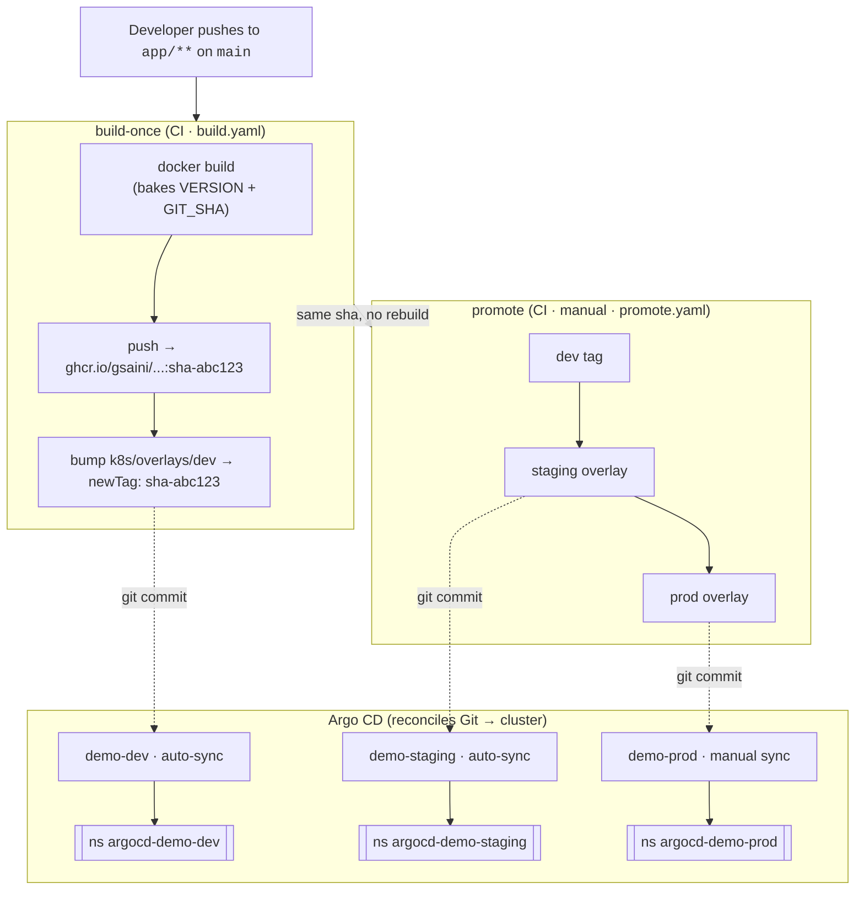

# Argo CD — Build Once, Deploy Many

> An end-to-end GitOps demo: build a container image **once**, then promote that
> exact same artifact through **dev → staging → prod** with Argo CD. Only
> configuration changes between environments — never the binary.


[](https://github.com/gsaini/argocd-getting-started/actions/workflows/build.yaml)
[](https://github.com/gsaini/argocd-getting-started/actions/workflows/validate.yaml)

---

## The core idea

In a healthy delivery pipeline you build an artifact **once**, test it, and then
promote *that same artifact* forward. Rebuilding per environment means each
environment runs subtly different bytes — the thing you tested is not the thing
you shipped.

This repo makes that principle concrete:

- **Built once** — CI builds `ghcr.io/gsaini/argocd-getting-started:sha-<commit>`
  and bakes the version + git SHA into the image. That immutable tag is the unit
  of promotion.
- **Deployed many** — three Kustomize overlays share one base. Promotion is
  literally copying the same image tag from one overlay to the next.
- **Reconciled by Argo CD** — each environment is an Argo CD `Application`. dev
  and staging auto-sync; prod waits for a human to click sync.

The running app shows this at a glance: **Build version** and **Git SHA** are
identical in every environment, while the **Environment** badge changes.

See [docs/architecture.md](docs/architecture.md) for the full write-up.

## Architecture



The **same `sha-abc123` image** flows through every stage — only the Kustomize
overlay (config, replicas, namespace) changes. `dev` and `staging` reconcile
automatically; `prod` waits for a human to run `argocd app sync demo-prod`.

## Repository layout

```
app/                      # tiny zero-dependency Node web app + Dockerfile
k8s/
  base/                   # environment-agnostic Deployment + Service + config
  overlays/
    dev/                  # APP_ENV=dev,     1 replica
    staging/              # APP_ENV=staging, 2 replicas
    prod/                 # APP_ENV=prod,    3 replicas, tighter limits
argocd/
  project.yaml            # AppProject (guardrails: repos, destinations)
  applications/           # one Application per environment
  app-of-apps.yaml        # root app that installs the three Applications
  applicationset.yaml     # alternative: generate all three from one list
.github/workflows/
  build.yaml              # build once -> push -> bump dev overlay
  promote.yaml            # copy the same tag dev -> staging -> prod
  validate.yaml           # kustomize build on every overlay (PR gate)
kargo/                    # optional: declarative dev -> staging -> prod promotion
scripts/bootstrap.sh      # apply the AppProject + app-of-apps
docs/architecture.md
```

## Getting started

From zero to three running environments on a local cluster in five steps. If you
just want to run the app without Kubernetes, jump to
[Try it locally](#try-it-locally-no-cluster).

### 1. Install the tools & clone

You'll need [`git`](https://git-scm.com/), [`kubectl`](https://kubernetes.io/docs/tasks/tools/),
a local cluster tool ([kind](https://kind.sigs.k8s.io/) shown here — minikube or
k3d work too), and optionally the
[Argo CD CLI](https://argo-cd.readthedocs.io/en/stable/cli_installation/).

```bash
git clone https://github.com/gsaini/argocd-getting-started.git
cd argocd-getting-started
```

> Forking? Swap `gsaini` for your GitHub user first — see
> [Using this in your own account](#using-this-in-your-own-account).

### 2. Create a local cluster

```bash
kind create cluster --name argocd-demo
kubectl cluster-info --context kind-argocd-demo   # sanity check
```

### 3. Install Argo CD

```bash
kubectl create namespace argocd
kubectl apply -n argocd -f \
  https://raw.githubusercontent.com/argoproj/argo-cd/stable/manifests/install.yaml
kubectl -n argocd rollout status deploy/argocd-server   # wait until Ready
```

### 4. Bootstrap the demo

```bash
./scripts/bootstrap.sh
# or directly:
kubectl apply -f argocd/project.yaml
kubectl apply -f argocd/app-of-apps.yaml
```

Then watch it reconcile — `demo-dev` and `demo-staging` go `Synced/Healthy` on
their own; `demo-prod` stays `OutOfSync` until you release it:

```bash
kubectl get applications -n argocd
argocd app list          # optional, needs the Argo CD CLI logged in
```

### 5. See an environment

```bash
kubectl -n argocd-demo-dev port-forward svc/web 8080:80
open http://localhost:8080         # try also /api/info and /healthz
```

Change the namespace to `argocd-demo-staging` or `argocd-demo-prod` to see the
other environments — same image, different badge.

> **Tear down** when you're done: `kind delete cluster --name argocd-demo`.

Next: promote a change through the environments below, or wire up
[Kargo](kargo/README.md) to automate it.

## The promotion flow

1. **Push a change to `app/`** on `main`. `build.yaml` builds one image, pushes
   it to GHCR, and updates `k8s/overlays/dev` to the new `sha-…` tag.
2. **Argo CD auto-syncs dev.** The new version is live in `argocd-demo-dev`.
3. **Promote to staging** — run the `promote` workflow with target `staging`
   (Actions tab → *promote* → *Run workflow*). It copies dev's tag into the
   staging overlay; Argo CD auto-syncs staging.
4. **Promote to prod** — run `promote` with target `prod`. It copies staging's
   tag into the prod overlay. Because prod is **manual-sync**, release with:

   ```bash
   argocd app sync demo-prod
   ```

No step rebuilds the image — the `sha-…` string is the only thing moving.

### Optional: automate promotion with Kargo

The flow above is driven by GitHub Actions (`promote.yaml`) plus a manual prod
sync. [Kargo](https://kargo.akuity.io/) can run the same dev → staging → prod
promotion declaratively: a `Warehouse` watches the image and `Stage`s move each
build forward, auto-promoting dev/staging and leaving prod as a manual gate. See
[kargo/README.md](kargo/README.md) for the manifests and how to enable it.

## Try it locally (no cluster)

```bash
cd app
APP_ENV=local node server.js
# http://localhost:8080
```

Or with Docker, baking build metadata exactly as CI does:

```bash
docker build -t argocd-demo ./app \
  --build-arg APP_VERSION=1.0.0-local \
  --build-arg GIT_SHA="$(git rev-parse --short HEAD)"
docker run --rm -p 8080:8080 -e APP_ENV=local argocd-demo
```

## Using this in your own account

The manifests reference `gsaini` as the GitHub owner. If you fork or copy this
repo, replace `gsaini` with your GitHub username/org in:

- `k8s/base/kustomization.yaml` and the three overlays (image name)
- `argocd/**` (repo URLs)
- the badge/links in this README

```bash
grep -rl gsaini . | xargs sed -i '' 's/gsaini/your-name/g'   # macOS
```

## License

[MIT](LICENSE)
